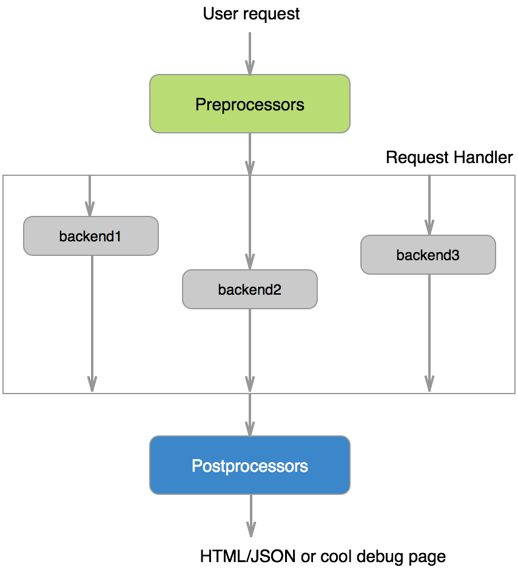

.. title:: Tortik

|Tortik|
========

Tortik is a micro framework atop of Python Tornado making easier to develop SOA-based applications.

Documentation available at `<http://glibin.github.io/tortik>`_

Explanation of SOA and tortik use cases at PyCon RU 2014 (in Russian) `<http://glibin.github.io/lections/pycon2014/>`_

Installation
------------

**Automatic installation**::

    pip install tortik

Tortik is listed in `PyPI <http://pypi.python.org/pypi/tortik>`_ and
can be installed with ``pip`` or ``easy_install``.

Documentation
-------------

.. toctree::
    :titlesonly:

    page

* :ref:`genindex`
* :ref:`modindex`
* :ref:`search`
